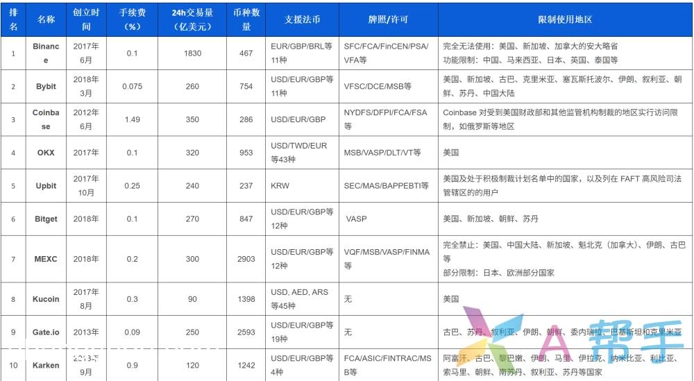
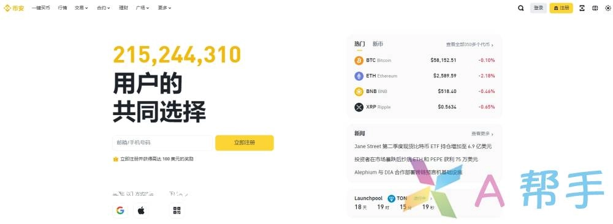
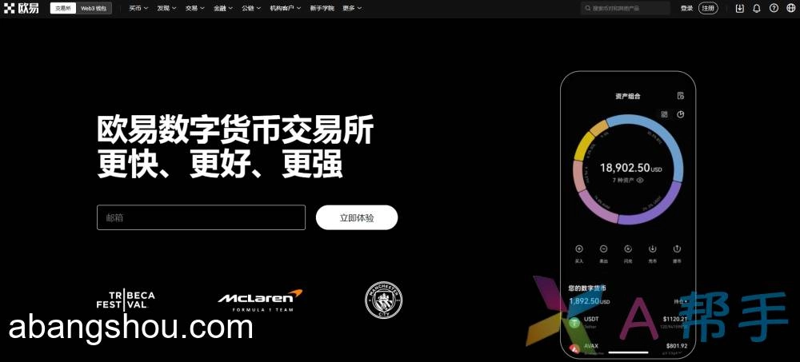

# Latest Crypto Exchange Registration Guide: New User Rewards + Fee Discounts (Available for Chinese Users)

Signing up for a cryptocurrency exchange in 2025? You're about to discover hidden perks most beginners never find. The big exchanges quietly offer substantial bonuses—reduced trading fees, welcome credits, and airdrop rewards—but only if you know where to look. This guide cuts through the noise and shows you exactly how to maximize your benefits across the top platforms that work reliably for Chinese-speaking users worldwide.

---

According to CoinMarketCap data from March 2025, roughly 800 cryptocurrency exchanges operate globally. They break down into four main categories: spot trading, derivatives, decentralized exchanges (DEX), and lending platforms. The first two—spot and derivatives—fall under centralized exchanges (CEX), which remain the most popular choice for traders seeking liquidity and user-friendly interfaces.

## Top-Rated Exchanges You Can Actually Use

Here's what the landscape looks like when you filter for real performance and accessibility:

### 1. Binance Exchange Perks

Binance sits at the top for good reason. The fee structure alone saves serious traders hundreds annually, and the newcomer benefits stack nicely:

**Fee Reduction Package:**
- 20% automatic discount on spot trading fees (activates immediately)
- Additional 25% off when you enable BNB payment—stacks with the base discount for 40% total savings
- Up to 200 USDT price protection on your first Bitcoin purchase (covers potential drops)
- 50 LA tokens just for depositing 100 USDT equivalent during promotional periods
- Binance 8th Anniversary competition with prizes including a 5-day Tokyo trip, MacBook Air, and 18,000 USDT prize pool

The math works out fast. If you're trading $10,000 monthly, that 40% fee reduction translates to roughly $40 saved per month—$480 annually.

**Register with referral code: 1133785796 to unlock all benefits**

### 2. OKX (Formerly OKEx)

OKX doesn't make much noise, but the platform's been quietly building something solid. Throughout 2024, they rode the ordinals wave and expanded their wallet services, which pushed them into the big leagues. What sets OKX apart isn't flashy marketing—it's the obsessive focus on making the interface work smoothly and keeping transaction speeds fast.

For Chinese-speaking traders especially, OKX has become the go-to alternative when other platforms hit regulatory snags. The registration process stays straightforward, and the platform handles high trading volumes without the lag you'll hit on smaller exchanges during volatile market moves.

New users who complete verification tasks can receive welcome rewards worth up to 100 USDT. 👉 [Start trading on OKX with reduced fees and beginner bonuses](https://www.okx.com/join/47044926)

### 3. Gate.io

Gate's been around since 2013—ancient history in crypto years. That longevity matters because they've survived multiple market cycles, which tells you something about their risk management. The platform holds over $10 billion in reserves and lists more than 3,500 trading pairs, giving you access to smaller altcoins you won't find on Binance or OKX.

Over 32 million registered users trust Gate for a reason: the platform rarely goes down during high volatility, and withdrawal processing stays reliable even when everyone's rushing for the exits during a crash.

**Geographic restrictions apply:** Users from the United States, Canada, Cambodia, Thailand, Cuba, Iran, and North Korea should switch to a different country IP for registration.

---

## The Smart Approach to Exchange Security

Here's the thing nobody wants to admit: no exchange is bulletproof. Binance dominates the market right now, but Mt. Gox dominated once too—and we all know how that ended. The platform held 70% of global Bitcoin trading volume before collapsing in 2014.

Don't put all your assets in one basket. Spread holdings across multiple exchanges. If you're holding long-term, move the bulk to cold storage. Keep only your active trading funds on exchanges. This isn't paranoia—it's basic risk management that's saved countless traders from total wipeouts when platforms face unexpected issues.

The best exchange strategy? Register on two or three platforms, claim the new user bonuses on each, then test their interfaces with small amounts. You'll quickly figure out which one fits your trading style, and you'll have backup options ready when you need them.

---

Exchange registration isn't complicated, but the hidden perks make a real difference in your returns. The fee discounts alone justify the five minutes it takes to sign up properly. Whether you're starting with Binance's market-leading liquidity, OKX's smooth interface, or Gate's extensive altcoin selection, using referral codes and promotional periods maximizes your starting position. 👉 [Get started with competitive trading fees and new user rewards](https://www.okx.com/join/47044926)
